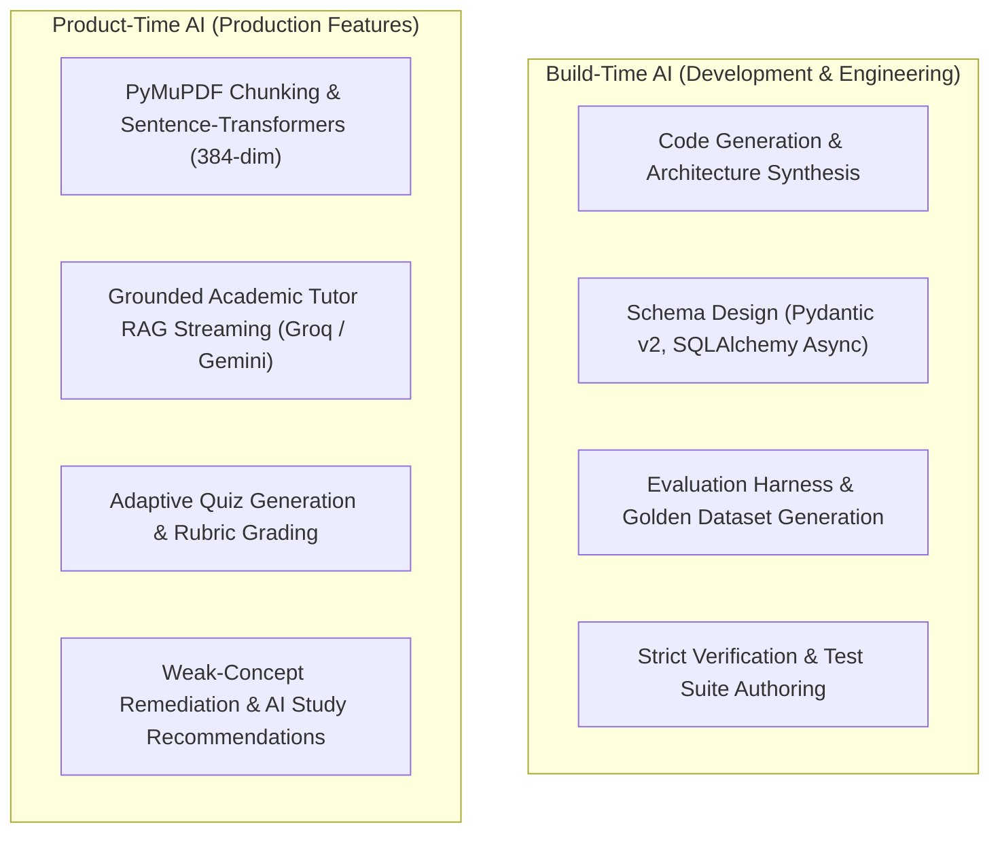

# AI Usage & Development Documentation

This document explains the division between **Build-Time AI Tools** (used to build and engineer the platform) and **Product-Time AI Features** (operating live within the application).

---

## 1. Build-Time AI vs Product-Time AI

---

## 2. Product-Time AI Architecture

### 2.1 Unified AIProvider Interface
All product-time inference is decoupled behind the `AIProvider` interface:
- **Groq Provider** (`groq_provider.py`): Primary engine for low-latency token streaming (e.g. `llama-3.3-70b-versatile`).
- **Gemini Provider** (`gemini_provider.py`): Primary engine for structured JSON schemas (e.g. `gemini-2.0-flash`, `gemini-3.6-flash`).
- **Local Embedding Provider** (`embedding_service.py`): High-throughput, zero-cost 384-dimensional vector embeddings via `sentence-transformers/all-MiniLM-L6-v2`.

### 2.2 Transparent Failover Resilience
When upstream APIs experience rate limits (e.g. HTTP 429 quota exhaustion on Google Gemini), the backend automatically and transparently fails over to Groq structured generation without degrading learner experience.

---

## 3. Prompt Engineering Standards

1. **Academic Professor Persona**: Uses 4-tier structured pedagogical breakdowns (Intuition $\rightarrow$ Mechanics/Math $\rightarrow$ Examples $\rightarrow$ Key Takeaways).
2. **Strict Sourcing**: Mandates explicit document name and page number citations.
3. **Active Retention**: Appends `### 💡 Quick Concept Check` active recall challenges.
4. **Honest Refusal**: Refuses ungrounded or out-of-scope queries rather than hallucinating.
