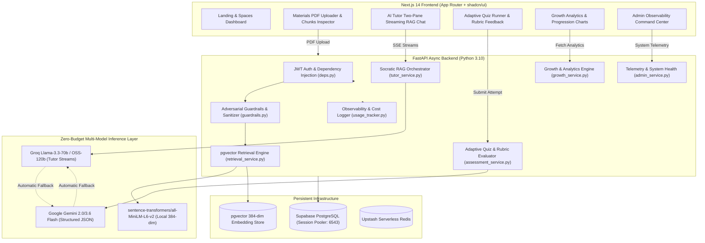

# AI Study Companion — System Architecture & Design Decisions

This document details the engineering architecture, data pipelines, security model, and $0 free-tier economics of the **AI Study Companion** platform.

---

## 1. High-Level Architecture

The platform connects Next.js 14 frontend clients to a FastAPI asynchronous backend backed by PostgreSQL with `pgvector` and an automated failover multi-model AI inference engine.

---

## 2. The 4 Core Subsystems

### 2.1 Knowledge & Material Ingestion Subsystem
- **PDF Extraction**: Uses `PyMuPDF` with OCR fallback to extract structured page-by-page text.
- **Sliding-Window Chunking**: Chunks text with ~500 token windows and 50 token overlaps to preserve semantic continuity across paragraph boundaries.
- **Local Embedding**: Embeds chunks locally via `sentence-transformers/all-MiniLM-L6-v2` into 384-dimensional dense vectors.
- **Database Storage**: Stores embeddings in Supabase PostgreSQL using `pgvector` with cosine similarity (`<=>`) indexes.

### 2.2 Socratic AI Tutor Subsystem
- **Grounded RAG Pipeline**:
  1. Screens incoming queries for prompt injection and boundary-escape patterns via `guardrails.screen_input`.
  2. Retrieves top-6 semantic chunks filtered strictly by `project_id`.
  3. Computes dynamic evidence confidence thresholds ($\ge 0.28$: High, $0.18 - 0.28$: Moderate, $< 0.18$: Low / Insufficient Evidence).
  4. Formats context inside explicit XML boundaries (`<retrieved_study_materials>`).
  5. Injects academic professor prompt enforcing 4-tier pedagogical breakdowns, mandatory inline/bibliography citations, active recall concept checks, and strict refusal on ungrounded questions.
  6. Streams Server-Sent Events (SSE) with millisecond token latency.

### 2.3 Adaptive Assessment & Rubric Engine
- **Weighted Concept Selection**: Ranks candidate project concepts using $W = (100 - \text{Score}) \times 1.5 + \max(0, 10 - \text{EvidenceCount}) \times 5.0$.
- **Dual-Format Generation**: Generates balanced MCQs (with plausible distractors) and conceptual Open-Ended questions.
- **Hybrid Grading**:
  - Deterministic exact-match for MCQs.
  - Multi-criteria LLM rubric evaluation for open-ended answers (identifying key concepts covered, concepts missing, and constructive feedback).
- **Mastery Calibration**: Dynamically updates concept mastery scores and transitions learner status (`improving`, `stable`, `needs_attention`).

### 2.4 Growth, Recommendations & Analytics
- **Learning Event Ledger**: Records append-only learning events with idempotent deduplication keys.
- **Targeted AI Recommendations**: Synthesizes specific student weaknesses, goal statements, and recent quiz mistakes into actionable study directives.
- **Analytics Aggregation**: Generates time-series quiz performance trendlines and mastery distribution charts.

---

## 3. Multi-Tenant Hard Security & Isolation Model

1. **Vector Layer Isolation**: Every vector retrieval query enforces `WHERE chunks.project_id = :project_id`. No cross-project leakage is mathematically possible.
2. **API Authorization Barrier**: `deps.get_project_or_403` verifies authenticated ownership of every project and space before dispatching service logic.
3. **Passive Context Boundaries**: Student documents are treated as untrusted data. Embedded instructions inside documents are sanitized and wrapped in passive XML tags.
4. **Prompt Injection Defense**: Real-time regex heuristics detect instruction overrides, persona hijacking, and special token injections.

---

## 4. $0 Free-Tier Economics

| Component | Provider & Tier | Cost |
|---|---|---|
| **Database & Vector Store** | Supabase Postgres (500 MB Free Tier) | $0.00 / mo |
| **Embeddings** | Local `sentence-transformers/all-MiniLM-L6-v2` | $0.00 / mo |
| **Tutor Streaming LLM** | Groq API Free Tier (`llama-3.3-70b-versatile`) | $0.00 / mo |
| **Structured Evaluator LLM** | Google Gemini Free Tier (`gemini-2.0-flash` / `gemini-3.6-flash`) | $0.00 / mo |
| **Cache / Broker** | Upstash Serverless Redis (10k commands/day free) | $0.00 / mo |
| **Frontend & Backend Hosting** | Vercel (Frontend) + Render / Railway (Backend) | $0.00 / mo |
