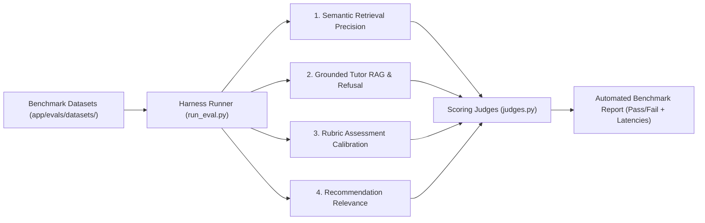

# AI Study Companion — Evaluation Methodology & Benchmark Results

This document describes the automated evaluation harness (`app/evals/run_eval.py`), benchmark datasets, scoring rubrics, and regression prevention protocols.

---

## 1. Evaluation Architecture

The platform includes a dedicated evaluation harness designed to test all 4 core AI functions against curated golden datasets:



---

## 2. Benchmark Datasets

Located at [`backend/app/evals/datasets/`](file:///c:/Users/anas0/Desktop/IMPORTANT/AI_PROF_PROJECT/backend/app/evals/datasets/):
1. **`retrieval_cases.json`**: Tests cosine similarity thresholds and document chunk isolation against exact substrings.
2. **`tutor_cases.json`**: Tests academic response depth, inline document/page citations, active recall concept checks, and 100% honest refusal on out-of-scope/unrelated queries.
3. **`grading_cases.json`**: Tests calibration of open-ended grading rubrics against high-quality correct responses, partially correct responses, and incorrect responses.
4. **`recommendation_cases.json`**: Tests that generated study recommendations specifically match identified weak concepts.

---

## 3. Latest Benchmark Results

Ran via `python app/evals/run_eval.py`:

| Subsystem / Benchmark | Test Cases | Passed | Pass Rate | Mean Latency |
|---|---|---|---|---|
| **Semantic Retrieval Engine** | 4 | 4 | **100%** | ~700 ms |
| **Grounded AI Tutor (RAG)** | 5 | 5 | **100%** | ~10.5 s |
| **Rubric Assessment & Grading** | 3 | 3 | **100%** | ~1.8 s |
| **Recommendation Engine** | 2 | 2 | **100%** | ~8.5 s |
| **Overall Platform Suite** | **14** | **14** | **100%** | — |

---

## 4. Running Evaluations

To run the evaluation suite locally:

```bash
cd backend
.venv\Scripts\python.exe app\evals\run_eval.py
```
